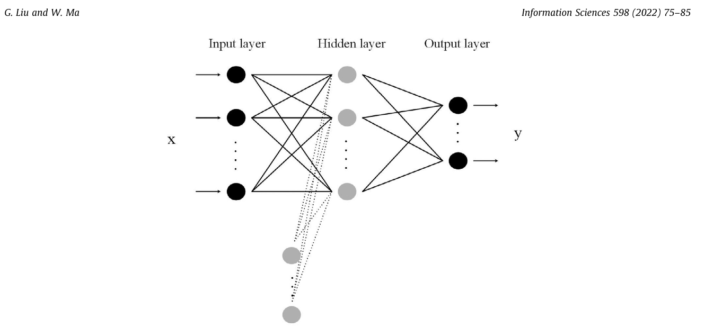
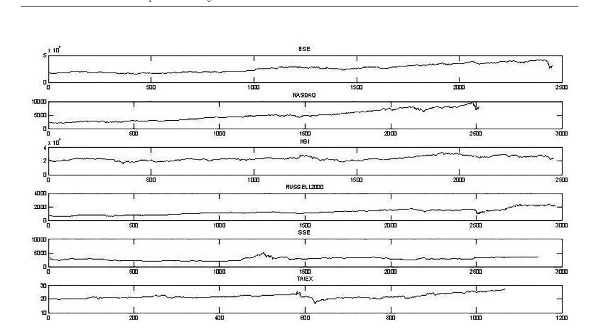
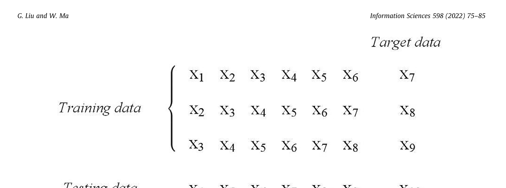
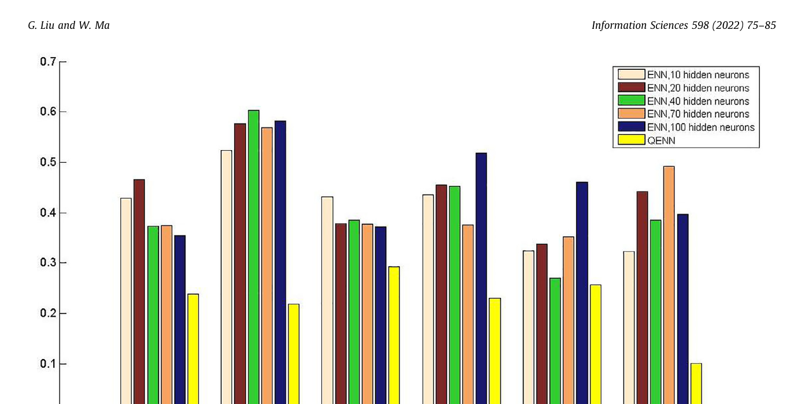

# A Quantum Artificial Neural Network for Stock Closing Price Prediction

**Authors:** Ge Liu (a,b) *, Wenping Ma (a,b)

**Affiliations:**
- (a) School of Telecommunications Engineering, Xidian University, Xi'an 710071, China
- (b) State Key Laboratory of Cryptology, P.O. Box 5159, Beijing 100878, China

**Corresponding Author:** Ge Liu — Email: 446552402@qq.com

**Journal:** Information Sciences 598 (2022) 75–85
**DOI:** https://doi.org/10.1016/j.ins.2022.03.064

**Article History:**
- Received: 20 October 2021
- Received in revised form: 15 March 2022
- Accepted: 19 March 2022
- Available online: 22 March 2022

**Keywords:** Elman neural network, Quantum computing, Stock market

---

## Abstract

In practice, stock market behavior is difficult to predict accurately because of its high volatility. To improve market forecasts, a method inspired by Elman neural network and quantum mechanics is presented. To render the network sensitive to dynamic information, the internal self-connection signal that is extremely useful for system modeling is introduced to the proposed technique. Double chains quantum genetic algorithm is employed to tune the learning rates. This model is validated by forecasting closing prices of six stock markets; the simulation results indicate that the proposed algorithm is feasible and effective. Accordingly, generalizing the method is deemed advantageous.

© 2022 Elsevier Inc. All rights reserved.

---

## 1. Introduction

The rapid development of national economy has led investors to favor stock trading. Different from conservative investment strategies, stock trading features high returns as well as risks. Accordingly, the foremost concerns of investors are stock index prediction, risk aversion and profit maximization.

In the fields of statistics and finance, the stock market is regarded as a complex nonlinear dynamic system with numerous variables. The market is affected by economy, politics and society [12, 14]; consequently, variations in the stock market are difficult to predict accurately. Although investors have attempted to overcome this difficulty based on their practical experience, solving the problem through such an approach is evidently impossible.

Over the past several decades, numerous competent and sophisticated forecasting schemes have been proposed [2, 8, 20, 22–24, 27, 30, 37, 38]. With the goal of achieving better prediction accuracy, researchers have focused on artificial neural network (ANN) [1, 2, 4, 6, 9, 10, 25, 37]. Based on the understanding of the biological neural network, researchers regard the brain as a complex information processing system in which functions are achieved by neurons. Subsequently, they have attempted to construct ANN to make machines more intelligent [15], even reading and thinking as human beings. Because a large number of neurons are interconnected in ANNs, modifying parameters (e.g., weight, bias) enables the networks to perform useful functions. Self-learning, self-adaptation, and fault-tolerance are the salient characteristics of this special system.

In this era of big data, classical neural networks have been widely used and become an important technology. ANN has played a significant role in medical care, engineering and so on, such as solving equations [34], human–machine interface [36], information security [7]. It is well-known that humanity is currently confronted with the COVID-19 problem; scholars have designed feed-forward and convolutional neural networks to classify the medical images from COVID-19 patients and medical images of other diseases, hoping to detect COVID-19 automatically and control the spread of the epidemic effectively [33].

However, despite the availability of more information, the limitations of ANNs persist, for instance: a high degree of algorithm complexity, inadequate generalization performance, low convergence speed, local minimum problem, and catastrophic forgetting. These disadvantages are the main constraints on the development of ANN; at the same time, they also promote the combination of ANN with other theories.

Due to the great potential application value and scientific significance, quantum computing has considerably attracted the interest of individual governments, military sector and academia. After years of work, scholars' efforts have yielded significant results. For example, blind quantum computing (BQC) is a newly developed computing pattern. In 2021, Li et al. [18] designed a new frame for federated learning based on BQC; it is able to utilize remote quantum servers and protect private data. Qu et al. [26] proposed a quantum fog computing scheme based on BQC that can ensure the security of data. With the development of related disciplines, some researchers have applied the basic principles of quantum mechanics to chemical research, leading to the development of an advanced independent subject — quantum chemistry, an important branch of theoretical chemistry.

There is no denying that the 21st century is evidently the key period for the development of quantum computing. The large-scope application of quantum computers will be a trend in the future; therefore, new algorithms and techniques must be devised [3, 16, 17, 21, 28, 29, 31, 35]. Because the combination of ANN and quantum computing has considerable prospects, the research in this field is extremely important.

The theoretical analysis and application prove that quantum neural network (QNN) offers the following potential advantages:
1. Exponential storage capacity
2. Simple structure
3. Better stability
4. High computing speed
5. Avoidance of catastrophic forgetting

We need to explore the potential of QNN and provide the public with more excellent services efficiently.

This study focuses on quantum Elman neural network (QENN) with the objective of designing a model with improved forecasting accuracy. In order to demonstrate its superiority, it is used to forecast stock market behavior.

**The main contributions and highlights of this study are as follows:**

1. The structure of the network is the main area of concern. In this model, self-connections of context neurons are added. This type of architecture can enhance the nonlinearity of QNN and improve the sensitivity of the network to dynamic information.
2. Adjusting the learning rate is an important method to accelerate convergence. To achieve this goal, a quantum version of genetic algorithm is used creatively.
3. As is well known, parallel computing can be realized due to the unique properties of quantum mechanics, so all possible states of QENN can be obtained, improving the prediction accuracy.

Currently, quantum technologies have become a magnet for new investment and received widespread public interest. There is a large collection of application scenarios where the model can flourish. For the economy, enterprises and governments can utilize QENN for financial forecasting, market trend analysis, macroeconomic data forecasting, and so on. Other applications include airline passenger traffic forecasting, maritime traffic forecasting, and fault diagnosis.

The scheme proposed in this paper is validated by forecasting the stock market closing prices; its applicability in other domains will also be tested. At present, ongoing QNN research is still in the theoretical stage. Its realization in a quantum environment depends on the development of quantum hardware. We need to make full use of the latest achievements in technology and utilize QENN for solving more practical problems.

**Paper structure:**
- Section 2: Theoretical concepts of Elman neural network (ENN), closing price, learning rate tuning, and linear superposition.
- Section 3: The QENN model using double chains quantum genetic algorithm (DCQGA) for adjusting learning rates.
- Section 4: Experimental investigations.
- Section 5: Conclusion.

---

## 2. Preliminary Theory

This section briefly describes quantum computing, neural network, and stock market to provide readers with background information.

### 2.1 Architecture of Elman Neural Network

The ENN was first proposed by J.L. Elman in 1990. It is a typical globally feedforward, locally recurrent network that includes an input layer, hidden layer, context layer, and output layer (see Fig. 1). The context layer (also called connecting layer) is a one-step time delay operator and plays a role of storing internal states. With the addition of an interior recurrent structure, ENN exhibits superior dynamic characteristics over static neural networks; it can efficiently process dynamic information.

**The communication among neurons in each layer can be expressed as follows (Equation 1):**

```
u(k)  = f( w1 * uc(k) + w2 * x(k-1) )
uc(k) = u(k-1)
y(k)  = g( w3 * u(k) )
```

**Where:**
- x   — input signal
- u   — output of hidden layer
- uc  — output of context layer
- y   — output of network
- w1  — connective weight from context layer to hidden layer
- w2  — connective weight from input layer to hidden layer
- w3  — connective weight from hidden layer to output layer
- f, g — activation functions



**Fig. 1.** The schematic of Elman neural network.

---

### 2.2 Closing Price

The stock market is a venue where stocks can be traded, including exchange markets and over-the-counter markets (OTC). It considerably promotes economic development.

Because stock prices fluctuate significantly, it is inevitable for investors to face the risk of failure, especially for the low-income crowd, whose characteristics make them especially vulnerable to risk. Even small disturbances may cause total loss.

Closing prices are the last transaction prices for each trading day and are publicly available. To reduce risk, investors predict changes in the stock market based on these historical prices.

---

### 2.3 Linear Superposition

Digital bits can be in only one state at a time: 0 or 1. Unlike a classical system, a quantum bit (qubit) is a linear superposition of basis states (|0⟩ and |1⟩) and is called a superposition state. Thus, a qubit |φ⟩ can be regarded as:

```
|φ⟩ = Σ_i  αi |i⟩   (i = 1, 2, ..., n)
```

where |i⟩ is the i-th computation basis state for an n-dimensional space, and:

```
Σ_i |αi|² = 1
```

When a slight perturbation (e.g., noise and heat) occurs, |φ⟩ collapses to one of the possible states |i⟩ with probability |αi|².

**Example:**

```
|φ⟩ = (1 / (3√2))|000⟩  +  (1/3)|001⟩  +  (1/3)|010⟩
      − (√5 / (3√2))|100⟩  +  (1/3)|011⟩  −  (1 / (3√2))|101⟩
      + (√3 / (3√2))|110⟩  −  (1/3)|111⟩
```

The appearance probabilities of states |000⟩, |001⟩, |010⟩, |100⟩, |011⟩, |101⟩, |110⟩, |111⟩ are:

```
1/18,  1/9,  1/9,  5/18,  1/9,  1/18,  3/18,  1/9   respectively.
```

If the quantum system collapses, all the information will be lost. How to detect useful information in the "fragile" quantum system is a hot topic, but it is not the focus of this work.

---

### 2.4 Learning Rate Tuning

Research on faster algorithms falls into several categories, and the learning rate is an important hyperparameter of neural networks. The trick is to determine when to modify the learning rate and by how much during the course of training.

- **Large learning rate:** Accelerates convergence and takes large steps; however, if extremely large, the algorithm may become unstable, fail to converge, or even diverge.
- **Sufficiently low learning rate:** Avoids oscillations in the loss function, making training stable, but requires major expenditure of time since each step is small.

**Common approaches for varying the learning rate include:**
1. **Learning rate annealing (also called learning rate decay):** Includes piecewise constant decay, inverse time decay, exponential decay, natural exponential decay, cosine decay, and so on.
2. **Learning rate warmup**
3. **Cyclical learning rate**

**Exponential decay** is a more common method in which the learning rate and number of epochs are closely related. The learning rate decreases as training progresses. The updating rule is (Equation 2):

```
α_t = α_0 * β^t
```

**Where:**
- α_0 — initial learning rate
- t    — the number of epochs
- β < 1 — decay rate

---

## 3. Quantum Elman Neural Network

### 3.1 Architecture of Quantum Elman Neural Network Model

According to the laws of quantum mechanics (superposition principle and quantum measurement postulate), a task of using a quantum system to construct ENN is described in this section. The structure of QENN is similar to that of ENN; it is noted that the context neuron can save the state at the previous moment of itself (self-connection feedback).

Suppose there are n_i, n_o neurons in the input layer and output layer respectively, and n_h neurons in the hidden layer and context layer. For simplicity, the structure of the network can be written as:

```
n_i × n_h × n_o
```

The mathematical expression and signal propagation of each layer is shown below:

---

#### Input Layer

The input of the neural network is represented as (Equation 3):

```
x(k) = ( x_1(k),  x_2(k),  ...,  x_{n_i}(k) )
```

Where:
- k — the k-th iteration

---

#### Hidden Layer

The state of the i-th neuron in the hidden layer is (Equation 4):

```
|y_i⟩(k) = f_0( x(k)·w_i + b_i + ã(k)·w̃_i ) |0⟩
           + f_1( x(k)·w_i + b_i + ã(k)·w̃_i ) |1⟩
```

**Where:**
- w_i ∈ R^{n_i}       — the weight from input layer to hidden layer
- b_i                  — the bias of the i-th neuron in hidden layer
- ã(k)                 — ( ã_1(k),  ã_2(k),  ...,  ã_{2·n_h}(k) )
- w̃_i ∈ R^{2·n_h}    — the weight from context layer to hidden layer
- f_0(x) = cos(e^x)
- f_1(x) = sin(e^x)

Because there are n_h neurons in the hidden layer, the combined state of this layer is (Equation 5):

```
|y_1⟩(k) ⊗ |y_2⟩(k) ⊗ ... ⊗ |y_{n_h}⟩(k)  =  Σ_{i=1}^{2^{n_h}}  α_i(k) |i⟩
```

**Where:**
- |i⟩ — i-th computation basis for a 2^{n_h}-dimensional Hilbert space

---

#### Context Layer

The state of the context layer is (Equation 6):

```
Σ_{i=1}^{2^{n_h}}  ã_i(k) |i⟩
=  Σ_{i=1}^{2^{n_h}}   [ (c · ã_i(k-1) + α_i(k-1)) / sqrt( Σ_{i=1}^{2^{n_h}} |c · ã_i(k-1) + α_i(k-1)|² ) ]  |i⟩
```

**Where:**
- 0 < c < 1 — self-connection feedback gain. This means that the k-th iteration output of the context layer is affected by both the (k-1)-th output of the hidden layer and the (k-1)-th output of the context layer.

---

#### Output Layer

The state of the l-th neuron in the output layer is (Equation 7):

```
|z_l⟩(k) = f_0( α(k)·v_l + b̃_l ) |0⟩  +  f_1( α(k)·v_l + b̃_l ) |1⟩
```

**Where:**
- α(k)             — ( α_1(k),  α_2(k),  ...,  α_{2^{n_h}}(k) )
- v_l ∈ R^{2^{n_h}} — the weight from hidden layer to output layer
- b̃_l              — the bias of the l-th neuron in output layer

The output layer is measured using the computation basis. The appearance probability of κ = {κ_1, κ_2, ..., κ_{n_o}} is (Equation 8):

```
p(κ) = Π_l  | f_{κ_l}( α(k)·v_l + b̃_l ) |²      l ∈ {1, 2, ..., n_o}
```

---

### 3.2 Learning Algorithm

The learning purpose is to minimize error through continuously modifying network parameters (weights and biases). In this paper, gradient descent with adaptive learning speed is used to train the network.

Suppose that the actual output vector at step k is y_d(k) and the target output vector is y. The normalized mean squared error is used as the performance metric — the closer the value to 0, the more accurate the model tends to be (Equation 9):

```
E = (1/N) · Σ_{k=0}^{N}  ( y_d(k) − y )^T · ( y_d(k) − y )
  = (1/N) · Σ_k  e²
```

**Where:**
- e — error signal
- N — the number of observations

Let the explicit function of weights and biases in the output layer be:

```
η_l = Σ_j  α_j(k) · v_l_j  +  b̃_l       (j = 1, 2, ..., 2^{n_h};  l = 1, 2, ..., n_o)
```

Therefore:
```
∂η_l / ∂v_l_j = α_j(k)
∂η_l / ∂b̃_l  = 1
```

Accordingly, the weight and bias updates for the output layer are (Equation 10):

```
Δv_l_j = −η_1 · (∂E / ∂v_l_j)
        = −η_1 · (∂E/∂e) · (∂e/∂η_l) · (∂η_l/∂v_l_j)
        = −η_1 · (2/N) · (y_d(k) − y) · ṗ(η_l) · α_j(k)

Δb̃_l  = −η_1 · (∂E / ∂b̃_l)
        = −η_1 · (∂E/∂e) · (∂e/∂η_l) · (∂η_l/∂b̃_l)
        = −η_1 · (2/N) · (y_d(k) − y) · ṗ(η_l)
```

Let the explicit function of weights and biases in the hidden layer be:

```
η̃_i = Σ_j  x_j(k) · w_i_j  +  b_i  +  Σ_q  ã_q(k) · w̃_i_q
       (j = 1, 2, ..., n_i;   q = 1, 2, ..., 2^{n_h};   i = 1, 2, ..., 2^{n_h})
```

Accordingly, the weight updates for the context-to-hidden weights and hidden biases are (Equation 11):

```
Δw̃_i_q = −η_2 · (∂E / ∂w̃_i_q)
         = −η_2 · (∂E/∂e) · (∂e/∂η̃_i) · (∂η̃_i/∂w̃_i_q)
         = −η_2 · (2/N) · (y_d(k) − y) · ṗ(η̃_i) · ã_q(k)

Δb_i    = −η_2 · (∂E / ∂b_i)
         = −η_2 · (∂E/∂e) · (∂e/∂η̃_i) · (∂η̃_i/∂b_i)
         = −η_2 · (2/N) · (y_d(k) − y) · ṗ(η̃_i)
```

And the update for input-to-hidden weights (Equation 12):

```
Δw_i_j = −η_3 · (∂E / ∂w_i_j)
        = −η_3 · (∂E/∂e) · (∂e/∂η̃_i) · (∂η̃_i/∂w_i_j)
        = −η_3 · (2/N) · (y_d(k) − y) · ṗ(η̃_i) · x_j(k)
```

**Where:**
- η_1, η_2, η_3 — learning rates

The parameters are updated according to the following equations (Equation 13):

```
v_l_j  (k+1) = v_l_j  (k) + Δv_l_j
b̃_l   (k+1) = b̃_l   (k) + Δb̃_l
w̃_i_q (k+1) = w̃_i_q (k) + Δw̃_i_q
b_i    (k+1) = b_i    (k) + Δb_i
w_i_j  (k+1) = w_i_j  (k) + Δw_i_j
```

---

**Operation Processes of QENN:**

1. Select an appropriate sample set; divide it into two parts: training samples and testing samples.
2. Design the structure of the quantum network.
3. Input training data and train the network. Determine the number of hidden neurons and context neurons according to running time and accuracy of information processing. The parameters (weights and biases) are automatically optimized simultaneously.
4. Supply the testing data to the network to obtain simulation results. Then preserve the error signal.
5. Calculate all error signals. If the final result is less than a specified threshold, or the number of iterations reaches a ceiling, the process stops.

---

### 3.3 Double Chains Quantum Genetic Algorithm (DCQGA)

Optimization algorithms provide a sound theoretical basis for artificial intelligence research and have been applied to solve a variety of problems [5, 11, 13, 19, 32]. Genetic algorithm (GA) is a type of search method derived from evolution laws of the biological world (survival of the fittest). The combination of quantum computing theory and GA, called quantum genetic algorithm (QGA), is an important area of research. In this section, DCQGA is employed to tune the learning rates (η_1, η_2, η_3).

---

#### Step 1: Initialization

Considering the randomness of population initialization and the constraint conditions of quantum states, a chromosome with two gene chains is defined as (Equation 14):

```
p_i =  | cos(t_{i1})   cos(t_{i2})   ...   cos(t_{in}) |
       | sin(t_{i1})   sin(t_{i2})   ...   sin(t_{in}) |

       (i = 1, 2, ..., m;   j = 1, 2, ..., n)
```

**Where:**
- t_{ij} = 2π · r    (0 < r < 1) — a random number
- m — the population size
- n — the number of quantum bits
- ( cos(t_{ij}),  sin(t_{ij}) ) — a state of a quantum bit

Each chromosome p_i is divided into two sequences (gene chains), each being a solution in search space (Equation 15):

```
p_ic = [ cos(t_{i1}),  cos(t_{i2}),  ...,  cos(t_{in}) ]
p_is = [ sin(t_{i1}),  sin(t_{i2}),  ...,  sin(t_{in}) ]
```

---

#### Step 2: Solution Space Transformation

Each chromosome is composed of n quantum bits (2n probability amplitudes). The j-th quantum bit, ( cos(t_{ij}),  sin(t_{ij}) ), can be expressed in the form (a^i_j,  b^i_j). Then the space is transformed based on the rule (Equation 16):

```
X^i_{jc} = (1/2) · [ b_j · (1 + a^i_j)  +  a_j · (1 − a^i_j) ]
X^i_{js} = (1/2) · [ b_j · (1 + b^i_j)  +  a_j · (1 − b^i_j) ]
```

**Where:**
- (a_j, b_j) — the range of the j-th independent variable

---

#### Step 3: Direction of Rotation Angle

The quantum rotation gate is used to update the probability amplitudes of qubits. It is a 2×2 matrix (Equation 17):

```
U(Δθ) =  | cos(Δθ)   −sin(Δθ) |
          | sin(Δθ)    cos(Δθ) |
```

Applying the rotation gate to a qubit (Equation 18):

```
U(Δθ) · | cos(t_{ij}) |  =  | cos(Δθ)   −sin(Δθ) | · | cos(t_{ij}) |
         | sin(t_{ij}) |     | sin(Δθ)    cos(Δθ) |   | sin(t_{ij}) |

                          =  | cos(t_{ij} + Δθ) |
                             | sin(t_{ij} + Δθ) |
```

To determine the direction of rotation angle, let (Equations 19, 20):

```
A = | a_0   a_1 |
    | b_0   b_1 |

direction = sgn(A)   if A ≠ 0
          = sgn(A)   if A = 0
```

**Where:**
- a_0, b_0 — probability amplitudes of a qubit in the current global optimal solution
- a_1, b_1 — probability amplitudes of the corresponding qubit in the current solution

---

#### Step 4: Size of Rotation Angle

The size of the rotation angle is determined by the following equation (Equation 21):

```
Δθ_{ij} = sgn(A) · Δθ_0 · exp( − | ∇f(X^i_j) | − ∇f_min  /  ∇f_max − ∇f_min )
```

**Where:**
- Δθ_0        — initial iterative value
- ∇f(X^i_j)   — the gradient of fitness function f at point X^i_j
- ∇f_max       — max over j of { |∂f(X^1) / ∂X^1_j|, ..., |∂f(X^m) / ∂X^m_j| }
- ∇f_min       — min over j of { |∂f(X^1) / ∂X^1_j|, ..., |∂f(X^m) / ∂X^m_j| }

According to the type of current global optimal solution, X^i_j can be set to either X^i_{jc} or X^i_{js}.

---

#### Step 5: Mutation Process

The matrix of the quantum NOT gate is (Equation 22):

```
X =  | 0   1 |
     | 1   0 |
```

It is used to achieve chromosome variation. First, some qubits are randomly selected from p_i based on the mutation probability; then X is applied to them, swapping the coefficients of |0⟩ and |1⟩.

**Example:** Suppose ( cos(t_{ij}),  sin(t_{ij}) ) = ( √3/2 ) |0⟩  − (1/2) |1⟩, then (Equation 23):

```
X · | √3/2 |  =  | 0   1 | · |  √3/2 |  =  | −1/2  |
    | −1/2 |     | 1   0 |   | −1/2  |     |  √3/2 |
```

---

**Algorithm Description (DCQGA):**

1. Initialize the population according to Equation 14. Set the initial value of step-length to θ_0 and set the mutation probability to a specified value.
2. Transform the solution space; calculate the fitness of each chromosome. Suppose the current solution is X̃_0 and the corresponding chromosome is p̃_0, and the current optimal solution is X_0 with corresponding chromosome p_0. If f(X̃_0) > f(X_0), then p_0 = p̃_0.
3. Determine the direction and size of the rotation angle according to Equation 20 and Equation 21, respectively.
4. The chromosome mutates based on mutation probability.
5. Go back to step 2. The iteration terminates until the number of iterations reaches a ceiling or the convergence condition is satisfied.

---

## 4. Experimental Investigations and Discussion

To study the performance of the proposed scheme, it is tested on real stock markets. The datasets used in this section are the closing prices for each trading day from six indices: Nasdaq, BSE Sensex, HSI, SSE, Russell 2000, and TAIEX. The information is publicly available and summarized in Table 1.

---

### Table 1: Datasets of Stock Markets

| Short Name   | Long Name                                          | Total Data Points | Maximum   | Minimum   | Average   |
|--------------|----------------------------------------------------|-------------------|-----------|-----------|-----------|
| BSE          | Bombay Stock Exchange                              | 2,454             | 41,953    | 15,175    | 26,163    |
| NASDAQ       | National Association of Securities Dealers Automated Quotation System | 2,517 | 9,817.2  | 2,091.8  | 4,920.1   |
| HSI          | Hang Seng Index                                    | 2,459             | 33,154    | 16,250    | 23,900    |
| SSE          | Shanghai (Securities) Composite Index              | 2,859             | 5,166.35  | 1,950.012 | 2,885.902 |
| Russell 2000 | Russell 2000 Index                                 | 2,965             | 2,442.74  | 590.03    | 1,274.104 |
| TAIEX        | Taiwan Capitalization Weighted Stock Index         | 1,068             | 27.5      | 16.66     | 22.018    |



**Fig. 2.** Daily closing prices of BSE, Nasdaq, HSI, SSE, Russell 2000, TAIEX.

---

### 4.1 Data Selection

This section describes the selection of input data and target output. A fixed-size sliding window moves through the entire dataset. With each slide, a new closing price is added and an old price is discarded; this means that the target output is affected by recent prices. The size of the window is a specified value determined by researchers.



**Fig. 3.** Training window generation.

---

### 4.2 Data Normalization

Table 1 and Fig. 2 indicate that the closing prices fluctuate significantly; it is more suitable to use normalized data in simulation analysis.

Consider a vector x = (x_1, x_2, ..., x_n). The normalization formula is defined as follows (Equation 24):

```
y_i = (y_max − y_min) · (x_i − x_min) / (x_max − x_min)  +  y_min       (i = 1, 2, ..., n)
```

**Where:**
- y_i   — the normalized value
- x_max — the maximum value of {x_1, x_2, ..., x_n}
- x_min — the minimum value of {x_1, x_2, ..., x_n}
- y_max = 1
- y_min = −1

**Example:** For x = (1, 2, 4):

```
y_1 = 2 · (1−1)/(4−1)  + (−1) = −1
y_2 = 2 · (2−1)/(4−1)  + (−1) = −1/3
y_3 = 2 · (4−1)/(4−1)  + (−1) =  1
```

So the vector form is y = (−1, −1/3, 1).

In this method, all closing prices can be normalized within [−1, 1].

---

### 4.3 Experimental Results

Using MATLAB as a tool, several networks are used to forecast the stock indices, including the proposed quantum model and classical ENNs. The hyperparameters of DCQGA are listed in Table 2.

---

### Table 2: Parameter Configuration of DCQGA

| Population Size (m) | Mutation Probability | Initial Value of Step-length (θ_0) | Number of Epochs | Number of Quantum Bits (n) |
|---------------------|----------------------|-------------------------------------|-----------------|---------------------------|
| 50                  | 0.1                  | 0.01π                               | 100             | 3                         |

---

The experiments demonstrate that when the learning rates are maintained within a reasonable bound, the algorithm yields better results. For QENN, the upper and lower bounds are set as:

```
10^{−5}    <  η_1  <  10^{−4}
2 × 10^{−5} <  η_2  <  10^{−4}
9 × 10^{−6} <  η_3  <  8 × 10^{−5}
```

The errors are obviously decreased within these ranges.

The performance metrics generated by different forecasting models from six stock markets are summarized in Table 3. Each result is obtained by averaging 10 independent runs. For the proposed QENN scheme, only a small number of hidden neurons and context neurons are needed to reach satisfactory precision, exhibiting superior performance compared to other classical models.

---

### Table 3: Experimental Results (Normalized Mean Squared Error — lower is better)

| Neural Network                   | BSE     | NASDAQ  | HSI     | SSE     | Russell 2000 | TAIEX   |
|----------------------------------|---------|---------|---------|---------|--------------|---------|
| 3-layer ENN, 10 hidden neurons   | 0.42828 | 0.52346 | 0.4312  | 0.4357  | 0.32455      | 0.32319 |
| 3-layer ENN, 20 hidden neurons   | 0.46543 | 0.57674 | 0.37841 | 0.45441 | 0.33697      | 0.44116 |
| 3-layer ENN, 40 hidden neurons   | 0.37341 | 0.60265 | 0.38527 | 0.45301 | 0.27028      | 0.38458 |
| 3-layer ENN, 70 hidden neurons   | 0.37489 | 0.56848 | 0.37749 | 0.37575 | 0.35211      | 0.49232 |
| 3-layer ENN, 100 hidden neurons  | 0.35443 | 0.58197 | 0.37209 | 0.51843 | 0.45973      | 0.3964  |
| **QENN, 5 hidden neurons**       | **0.23782** | **0.2183** | **0.29263** | **0.22984** | **0.25729** | **0.10163** |



**Fig. 4.** Comparison of all experimental results.

---

**Conclusions from experiments:**

1. In the proposed quantum model, self-connection is added to each context neuron, making it more sensitive to the history of data — extremely useful in dynamic system modeling.
2. It is proved that using quantum Elman neural network to forecast stock market behavior is effective.
3. The quantum forecasting method proposed in this paper is characterized by better prediction accuracy compared with other schemes.

---

## 5. Conclusion

This paper proposed a QENN scheme that captures the high volatility, complex nonlinearity, dynamic characteristic, and time-varying nature of stock market data. It has been successfully employed for the prediction of closing prices. The principles of ENN, closing price, learning rate tuning, and linear superposition were introduced. Then, a QENN scheme was designed that combines the advantages of genetic algorithm and machine learning. Finally, case analysis and simulation results were presented.

**Main characteristics of the proposed scheme:**

1. The activation method of classical neurons was combined with quantum theories. Due to quantum parallelism, all possible states of QENN can be obtained simultaneously.
2. Based on the study of classical neural networks, internal self-connections are added to optimize the network structure. Compared to classical networks, the test accuracies of QENN are improved significantly.
3. DCQGA is used to tune the learning rates. The experimental results show that DCQGA is suitable for optimizing the parameters of neural networks.

**Limitations:**

1. Although scientists have made breakthroughs in quantum computer research, the large-scale application of such equipment remains distant. It is important to study how this scheme can be realized in a quantum environment.
2. Under the current hardware framework, it is still time-consuming to train the network. Further optimization of the learning algorithm and reduction in execution time is needed.

**Future work:** The key to overcoming these limitations is the study of quantum hardware. The authors will pay close attention to quantum computers and design networks more suitable for quantum environments. For algorithm optimization, parameter initialization is an important step closely related to convergence speed; better initialization algorithms will be investigated since the current distribution of random numbers is not uniform.

---

## CRediT Authorship Contribution Statement

- **Ge Liu:** Conceptualization, Software, Writing – original draft, Writing – review & editing.
- **Wenping Ma:** Conceptualization, Formal analysis.

---

## Declaration of Competing Interest

The authors declare that they have no known competing financial interests or personal relationships that could have appeared to influence the work reported in this paper.

---

## Acknowledgments

This work is partially supported by:
- National Key R&D Program of China (Grant No. 2017YFB0802400)
- National Science Foundation of China (Grant No. 61373171, 61702007)
- The 111 Project (Grant No. B08038)

---

## References

[1] E. Abbasi, A. Abouec, "Stock price forecast by using neuro-fuzzy inference system," *Proceedings of the World Academy of Science*, 36 (2008), 320–323.

[2] R. Adhikari, R.K. Agrawal, "A combination of artificial neural network and random walk models for financial time series forecasting," *Neural Computing and Applications*, 24(6) (2014), 1441–1449.

[3] G. Acampora, A. Vitiello, "Implementing evolutionary optimization on actual quantum processors," *Information Sciences*, 575 (2021), 542–562.

[4] G.S. Atsalakis, K.P. Valavanis, "Forecasting stock market short-term trends using a neuro-fuzzy based methodology," *Expert Systems with Applications*, 36(7) (2009), 10696–10707.

[5] F. Behroozi, S.M.H. Hosseini, S.S. Sana, "Teaching-learning-based genetic algorithm (TLBGA): an improved solution method for continuous optimization problems," *International Journal of Systems Assurance Engineering and Management*, 12 (2021), 1362–1384.

[6] F.S. Board, "Artificial intelligence and machine learning in financial services," (2017).

[7] M. Botta, D. Cavagnino, R. Esposito, "NeuNAC: A novel fragile watermarking algorithm for integrity protection of neural networks," *Information Sciences*, 576 (2021), 228–241.

[8] A. Esfahanipour, W. Aghamiri, "Adapted neuro-fuzzy inference system on indirect approach TSK fuzzy rule base for stock analysis," *Expert Systems with Applications*, 37(7) (2010), 4742–4748.

[9] S.H. Gu, B.T. Kelly, D.C. Xiu, "Empirical asset pricing via machine learning," *31st Australasian Finance and Banking Conference* (2018).

[10] R. Ghasemieh, R. Moghdani, S.S. Sana, "A hybrid artificial neural network with metaheuristic algorithms for predicting stock price," *Cybernetics and Systems*, 48(4) (2017), 365–392.

[11] S.M.H. Hossein, S.S. Sana, M. Rostami, "Assembly flow shop scheduling problem considering machine eligibility restrictions and auxiliary resource constraints," *International Journal of Systems Science: Operations & Logistics* (2021), 1–17.

[12] M.W. Hsu, L. Stefan, M.C. Sung, T.J. Ma, J.E.V. Johnson, "Bridging the divide in financial market forecasting: machine learners vs. financial economists," *Expert Systems with Applications*, 61 (2016), 215–234.

[13] G. Jamali, S.S. Sana, R. Moghdani, "Hybrid improved cuckoo search algorithm and genetic algorithm for solving Markov-modulated demand," *RAIRO Operations Research*, 52(2) (2018), 473–497.

[14] K.K. Kotha, B. Sahu, "Macroeconomic factors and the Indian stock market: exploring long and short run relationships," *International Journal of Economics and Financial Issues*, 6(3) (2016), 1081–1091.

[15] P.S. Lamba, D. Virmani, O. Castillo, "Multimodal human eye blink recognition method using feature level fusion for exigency detection," *Soft Computing*, 24(22) (2020), 16829–16845.

[16] H.S. Li, P. Fan, H.Y. Xia, S.X. Song, "Quantum multi-level wavelet transforms," *Information Sciences*, 504 (2019), 113–135.

[17] L. Li, Z. Li, "A verifiable multi-party quantum key distribution protocol based on repetitive codes," *Information Sciences*, 585 (2022), 232–245.

[18] W.K. Li, S.R. Lu, D.L. Deng, "Quantum federated learning through blind quantum computing," *Science China Physics, Mechanics & Astronomy*, 64 (2021), 100312.

[19] D.R. Mahapatra, S. Panda, S.S. Sana, "Multi-choice and stochastic programming for transportation problem involved in supply of foods and medicines to hospitals with consideration of logistic distribution," *RAIRO Operations Research*, 54(4) (2020), 1119–1132.

[20] N. Mizani, R. Sheikh, A. Gholami, S.S. Sana, "Attracting and retaining customers by axiomatic design and incomplete rough-set theory," *International Journal of Applied and Computational Mathematics*, 4(2) (2018), 1–17.

[21] L. Mu, P. Wang, G. Xin, "Quantum-inspired algorithm with fitness landscape approximation in reduced dimensional spaces for numerical function optimization," *Information Sciences*, 527 (2020), 253–278.

[22] M. Najafzadeh, H. Bonakdari, "Application of a neuro-fuzzy GMDH model for predicting the velocity at limit of deposition in storm sewers," *Journal of Pipeline Systems Engineering and Practice*, 8(1) (2017), 06016003.

[23] M. Najafzadeh, F. Saberi-Movahed, "GMDH-GEP to predict free span expansion rates below pipelines under waves," *Marine Georesources & Geotechnology*, 37(3) (2019), 375–392.

[24] M. Najafzadeh, F. Saberi-Movahed, S. Sarkamaryan, "NF-GMDH-Based self-organized systems to predict bridge pier scour depth under debris flow effects," *Marine Georesources & Geotechnology*, 36(5) (2018), 589–602.

[25] S.C. Nayak, B.B. Misra, H.S. Behera, "ACFLN: artificial chemical functional link network for prediction of stock market index," *Evolving Systems*, 10 (2019), 567–592.

[26] Z.G. Qu, K.Y. Wang, M. Zheng, "Secure quantum fog computing model based on blind quantum computation," *Journal of Ambient Intelligence and Humanized Computing* (2021).

[27] P.A. Rahman, A.A. Panchenko, A.M. Safarov, "Using neural networks for prediction of air pollution index in industrial city," *IOP Conference Series: Earth and Environmental Science*, 87(4) (2017), 042016.

[28] O.H.M. Ross, "A review of quantum-inspired metaheuristics: going from classical computers to real quantum computers," *IEEE Access*, 8 (2020), 814–838.

[29] F. Shahid, A. Khan, S.U.R. Malik, K.K.R. Choo, "WOTS-S: a quantum secure compact signature scheme for distributed ledger," *Information Sciences*, 539 (2020), 229–249.

[30] M. Shaverdi, S. Fallahi, V. Bashiri, "Prediction of stock price of Iranian petrochemical industry using GMDH-type neural network and genetic algorithm," *Applied Mathematical Sciences*, 6(7) (2012), 319–332.

[31] H. Situ, Z.M. He, Y.Y. Wang, L.Z. Li, S.G. Zheng, "Quantum generative adversarial network for generating discrete distribution," *Information Sciences*, 538 (2020), 193–208.

[32] M.A. Takami, R. Sheikh, S.S. Sana, "Product portfolio optimisation using teaching-learning-based optimisation algorithm: a new approach in supply chain management," *International Journal of Systems Science: Operations & Logistics*, 3(4) (2016), 236–246.

[33] S. Varela-Santos, P. Melin, "A new approach for classifying coronavirus COVID-19 based on its manifestation on chest X-rays using texture features and neural networks," *Information Sciences*, 545 (2021), 403–414.

[34] G.C. Wang, Z.H. Hao, B. Zhang, L. Jin, "Convergence and Robustness of Bounded Recurrent Neural Networks for Solving Dynamic Lyapunov Equations," *Information Sciences*, 588 (2022), 106–123.

[35] C.H. Wu, L.S. Ke, Y.S. Du, "Quantum resistant key-exposure free chameleon hash and applications in redactable blockchain," *Information Sciences*, 548 (2021), 438–449.

[36] A.G. Zhang, Y.Z. Niu, Y.M. Gao, J.Y. Wu, Z.P. Gao, "Second-order information bottleneck based spiking neural networks for sEMG recognition," *Information Sciences*, 585 (2022), 543–558.

[37] G.Q.P. Zhang, "Time series forecasting using a hybrid ARIMA and neural network model," *Neurocomputing*, 50 (2003), 159–175.

[38] X. Zhong, D. Enke, "Forecasting daily stock market return using dimensionality reduction," *Expert Systems with Applications*, 67 (2017), 126–139.
